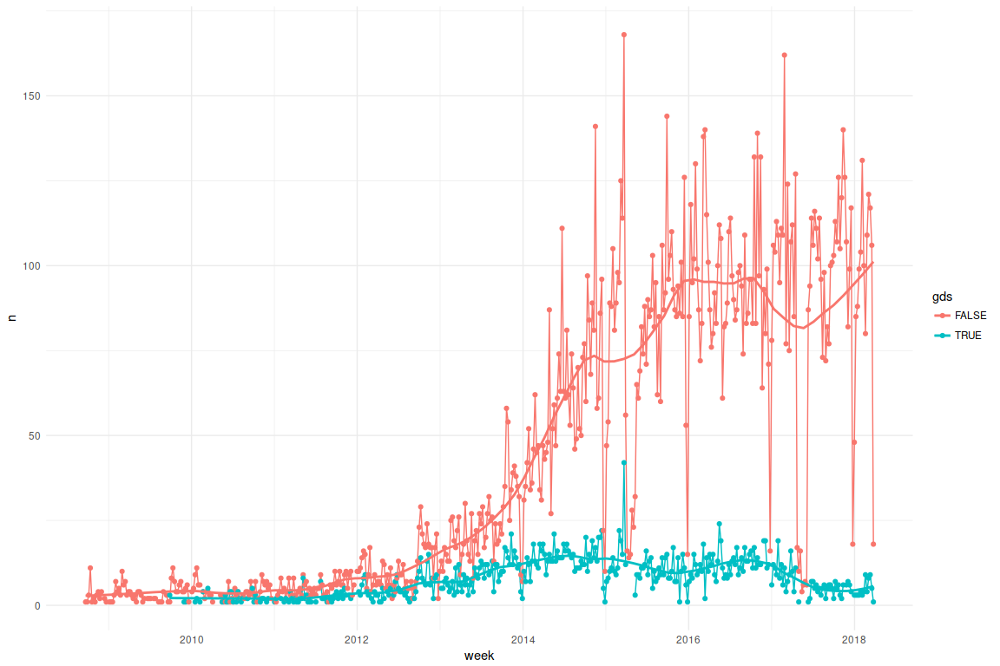
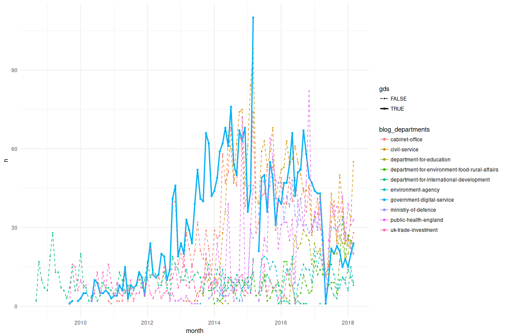
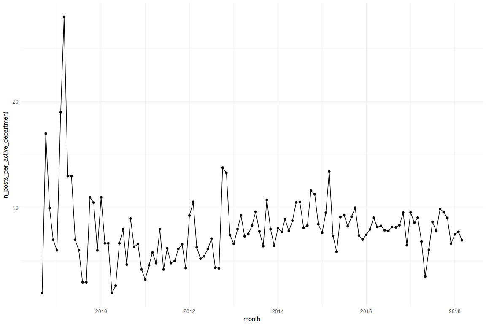
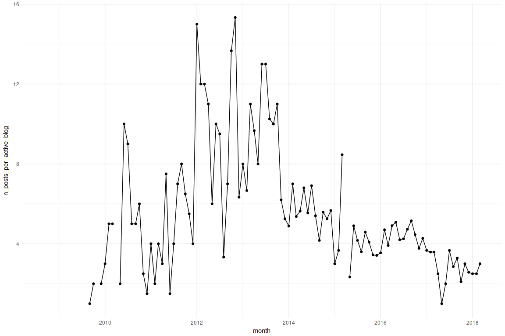

Rough and ready blog.gov.uk trends
================
nacnudus
Sat Feb 17 22:46:03 2018

``` r
# Scrape the list of all blogs from https://www.blog.gov.uk/, and then scrape
# each individual blog, e.g. https://gds.blog.gov.uk/.  That's how to get the
# full history of blog posts (as far as I can tell).

library(tidyverse)
```

    ## ── Attaching packages ────────────────────────────────── tidyverse 1.2.1 ──

    ## ✔ ggplot2 2.2.1          ✔ purrr   0.2.4.9000
    ## ✔ tibble  1.4.2          ✔ dplyr   0.7.4.9000
    ## ✔ tidyr   0.8.0          ✔ stringr 1.2.0     
    ## ✔ readr   1.1.1          ✔ forcats 0.2.0

    ## ── Conflicts ───────────────────────────────────── tidyverse_conflicts() ──
    ## ✖ dplyr::filter() masks stats::filter()
    ## ✖ dplyr::lag()    masks stats::lag()

``` r
library(rvest)
```

    ## Loading required package: xml2

    ## 
    ## Attaching package: 'rvest'

    ## The following object is masked from 'package:purrr':
    ## 
    ##     pluck

    ## The following object is masked from 'package:readr':
    ## 
    ##     guess_encoding

``` r
library(lubridate)
```

    ## 
    ## Attaching package: 'lubridate'

    ## The following object is masked from 'package:base':
    ## 
    ##     date

``` r
library(here)
```

    ## here() starts at /home/nacnudus/R/bloggovuk

    ## 
    ## Attaching package: 'here'

    ## The following object is masked from 'package:lubridate':
    ## 
    ##     here

``` r
redownload <- FALSE

# Download data if required ----------------------------------------------------

if (redownload) {

  all_blogs_url <- "https://www.blog.gov.uk/"
  all_blogs_html <- read_html(all_blogs_url)
  blog_list_items <- html_nodes(all_blogs_html, "[data-blog-item]")

  scrape_blog_list_item <- function(node) {
    a <- html_nodes(node, "a")
    list(
         blog_url = html_attr(a, "href"),
         blog_name = html_text(a),
         blog_department = html_attr(node, "data-blog-departments"),
         blog_topic = html_node(node, "p") %>% html_text()
         )
  }
  blogs <- map_dfr(blog_list_items, scrape_blog_list_item)
  saveRDS(blogs, here("data", "blogs.Rds")) # save early in case next step fails

  # Nest multiple departments per blog
  blogs <-
    blogs %>%
    mutate(blog_departments = map(blog_department, ~ str_split(.x, " ")[[1]]),
           department_names = map(blog_departments, str_extract, "[-a-zA-Z]+$")) %>%
    select(-blog_department)
  saveRDS(blogs, here("data", "blogs.Rds")) # save again having cleaned the names

  # Individual blog scraper ------------------------------------------------------

  scrape_individual_blog_list_item <- function(node) {
    entry_title <- html_node(node, ".entry-title")
    list(
         post_url = html_node(entry_title, "a") %>% html_attr("href"),
         post_datetime = html_node(node, ".updated") %>% html_attr("datetime"),
         post_title = html_text(entry_title),
         post_blurb = html_node(node, ".entry-summary p") %>% html_text()
         )
  }

  scrape_individual_blog_page <- function(page_url) {
    cat(page_url, "\n")
    page_html <- read_html(page_url)
    list_items <- html_nodes(page_html, ".hentry")
    map_dfr(list_items, scrape_individual_blog_list_item)
  }

  scrape_individual_blog <- function(blog_home_url) {
    cat(blog_home_url, "\n")
    # Count how many pages to scrape
    blog_home_html <- read_html(blog_home_url)
    page_tabs <- html_nodes(blog_home_html, ".list-inline a")
    n_pages <-
      page_tabs[length(page_tabs)] %>%
      html_text() %>%
      parse_number()
    if (length(n_pages) == 0) n_pages <- 1
    page_urls <- paste0(blog_home_url, "/page/", seq_len(n_pages))
    posts <- map_dfr(page_urls, scrape_individual_blog_page)
    saveRDS(posts, here("data",
                        paste0(str_extract(blog_home_url,
                                           "(?<=\\/)[-a-zA-Z0-9]+"),
                               "_posts.Rds"))) # save early
    posts %>%
      mutate(blog_url = blog_home_url)
  }

  individual_posts <- map_dfr(blogs$blog_url, scrape_individual_blog)

  # Discontinued blogs ---------------------------------------------------------
  # (that aren't listed on blog.gov.uk, instead go to the National Archives)

  all_archived_websites_url <- "http://www.nationalarchives.gov.uk/webarchive/atoz/"
  all_archived_websites_html <- read_html(all_archived_websites_url)

  blog_urls <-
    all_archived_websites_html %>%
    html_nodes(".entry-content ul li a") %>%
    html_attr("href") %>%
    tibble(href = .) %>%
    filter(str_detect(href, "\\.blog\\.gov\\.uk")) %>%
    transmute(blog_url = str_extract(href,
                                     "(?<=\\/)https:\\/\\/[-a-zA-Z0-9]+\\.blog\\.gov\\.uk"))

    # Blogs that haven't been archived
    anti_join(blogs, blog_urls) %>% print(n = Inf)

    # Blogs that have been discontinued and archived
    discontinued <-
      anti_join(blog_urls, blogs) %>%
      print(n = Inf)

    discontinued_posts <- map_dfr(discontinued$blog_url, scrape_individual_blog)

    # Blog names, organisations, etc.
    get_blog_meta <- function(blog_url) {
      cat(blog_url, "\n")
      blog_html <- read_html(blog_url)
      blog_name <-
        blog_html %>%
        html_nodes(".blog+ a") %>%
        html_text()
      blog_department_nodes <- html_nodes(blog_html, ".blog-meta a")
      blog_departments <-
        blog_department_nodes %>%
        html_attr("href") %>%
        str_split(" ") %>%
        unlist() %>%
        list()
      department_names <- list(html_text(blog_department_nodes))
      tibble(blog_url = blog_url,
             blog_name = blog_name,
             blog_departments = blog_departments,
             department_names = department_names)
    }
    discontinued_blogs <- map_dfr(discontinued$blog_url, get_blog_meta)

    all_blogs <- bind_rows(blogs, discontinued_blogs)
    saveRDS(all_blogs, here("data", "blogs.Rds"))

}

# Or load from files -----------------------------------------------------------

blogs <- readRDS(here("data", "blogs.Rds"))

files <- list.files(here("data"), "*_posts.Rds", full.names = TRUE)
individual_posts <-
  map_dfr(files, readRDS) %>%
  distinct()

# Clean dates and names --------------------------------------------------------

parse_post_url_date <- function(x) {
  parse_datetime(str_extract(x, "(?<=\\.uk\\/)[0-9]{4}\\/[0-9]{2}\\/[0-9]{2}"),
                 "%Y/%m/%d")
}

individual_posts <-
  individual_posts %>%
  filter(!str_detect(post_url, "201\\/06")) %>%
  mutate(blog_url = str_extract(post_url,
                                ".*\\.blog\\.gov\\.uk"),
         blog_name = str_extract(blog_url, "(?<=\\/)[-a-zA-Z0-9]+"),
         post_datetime = if_else(is.na(post_datetime),
                                 parse_post_url_date(post_url),
                                 parse_datetime(post_datetime)),
         post_datetime = if_else(post_url == "https://mattersoftesting.blog.gov.uk/mot-services-were-working-on-23-january-2018/",
                                 ymd_hms("2018-01-23 00:00:00"),
                                 post_datetime))

saveRDS(individual_posts, here("data", "indiposts.Rds"))
individual_posts <- readRDS(here("data", "indiposts.Rds"))

# Write to TSV in case others want to use it -----------------------------------

write_tsv(individual_posts, here("data", "posts.tsv"))
write_tsv(unnest(blogs), here("data", "blogs.tsv"))

# Analysis ---------------------------------------------------------------------

theme_set(theme_grey() + theme_minimal())

posts <- individual_posts
```

## Range of dates.

``` r
range(posts$post_datetime)
```

    ## [1] "2008-09-23 11:50:09 UTC" "2018-02-16 18:07:12 UTC"

``` r
# [1] "2008-09-23 11:50:09 UTC" "2018-02-16 18:07:12 UTC"
```

## Number of blogs by department. Shared blogs count once for each department.

Blank department names usually occur when the blog is by an individual

``` r
blogs %>%
  unnest(department_names) %>%
  count(department_names, sort = TRUE)
```

    ## # A tibble: 96 x 2
    ##    department_names                                          n
    ##    <chr>                                                 <int>
    ##  1 government-digital-service                               10
    ##  2 ""                                                        8
    ##  3 civil-service                                             8
    ##  4 cabinet-office                                            7
    ##  5 Government Digital Service                                7
    ##  6 Department for Business, Energy & Industrial Strategy     5
    ##  7 Department for Work and Pensions                          4
    ##  8 department-for-environment-food-rural-affairs             4
    ##  9 driver-and-vehicle-standards-agency                       4
    ## 10 ministry-of-defence                                       4
    ## # ... with 86 more rows

## Number of blog posts by department.

Posts on shared blogs count once for each department.

``` r
posts %>%
  left_join(blogs, by = "blog_url") %>%
  unnest(department_names) %>%
  count(department_names, sort = TRUE)
```

    ## # A tibble: 90 x 2
    ##    department_names                             n
    ##    <chr>                                    <int>
    ##  1 cabinet-office                            2498
    ##  2 government-digital-service                2384
    ##  3 civil-service                             2281
    ##  4 public-health-england                     1484
    ##  5 ministry-of-defence                       1317
    ##  6 Department for International Development   781
    ##  7 Government Digital Service                 655
    ##  8 UK Trade & Investment                      618
    ##  9 environment-agency                         506
    ## 10 department-of-health                       469
    ## # ... with 80 more rows

## Number of blog posts by blog. Posts on shared blogs count only once.

``` r
posts %>%
  count(blog_name, sort = TRUE)
```

    ## # A tibble: 135 x 2
    ##    blog_name               n
    ##    <chr>               <int>
    ##  1 modmedia             1057
    ##  2 civilservicelocal    1040
    ##  3 gds                   874
    ##  4 civilservice          835
    ##  5 dfid                  781
    ##  6 publichealthmatters   703
    ##  7 ukti                  618
    ##  8 insidegovuk           574
    ##  9 dfemedia              415
    ## 10 phescreening          395
    ## # ... with 125 more rows

## Number of posts timeseries by department, alphabetical.

Posts on shared blogs count once for each department.

``` r
posts %>%
  left_join(blogs, by = "blog_url") %>%
  unnest(blog_departments) %>%
  mutate(blog_departments = str_extract(blog_departments,
                                        "(?<=\\/)[^\\/]+$")) %>%
  ggplot(aes(post_datetime, blog_departments)) +
  geom_point(shape = "|") +
  theme(panel.grid.major.x = element_blank(),
        panel.grid.minor.x = element_blank())
```

<!-- -->

## Number of posts timeseries by department, ordered by total number.

Posts on shared blogs count once for each department. DCMS has recently
been renamed, hence seeming to have few posts.

``` r
posts %>%
  left_join(blogs, by = "blog_url") %>%
  unnest(blog_departments) %>%
  mutate(blog_departments = str_extract(blog_departments,
                                        "(?<=\\/)[^\\/]+$")) %>%
  mutate(blog_departments = fct_infreq(blog_departments)) %>%
  ggplot(aes(post_datetime, blog_departments)) +
  geom_point(shape = "|") +
  theme(panel.grid.major.x = element_blank(),
        panel.grid.minor.x = element_blank())
```

<!-- -->

## Number of posts timeseries by department, ordered by earliest post.

Posts on shared blogs count once for each department. I was surprised to
see that the Government Digital Service blog wasn’t the first. Were the
others migrated to the platform with posts that predated it?

``` r
posts %>%
  left_join(blogs, by = "blog_url") %>%
  unnest(blog_departments) %>%
  mutate(blog_departments = str_extract(blog_departments,
                                        "(?<=\\/)[^\\/]+$")) %>%
  group_by(blog_departments) %>%
  mutate(first_post = min(post_datetime)) %>%
  ungroup() %>%
  mutate(blog_departments = fct_reorder(blog_departments, first_post)) %>%
  ggplot(aes(post_datetime, blog_departments)) +
  geom_point(shape = "|") +
  theme(panel.grid.major.x = element_blank(),
        panel.grid.minor.x = element_blank())
```

<!-- -->

## Number of posts timeseries by department, ordered by latest post.

Posts on shared blogs count once for each department.

``` r
posts %>%
  left_join(blogs, by = "blog_url") %>%
  unnest(blog_departments) %>%
  mutate(blog_departments = str_extract(blog_departments,
                                        "(?<=\\/)[^\\/]+$")) %>%
  group_by(blog_departments) %>%
  mutate(last_post = max(post_datetime)) %>%
  ungroup() %>%
  mutate(blog_departments = fct_reorder(blog_departments, last_post)) %>%
  ggplot(aes(post_datetime, blog_departments)) +
  geom_point(shape = "|") +
  theme(panel.grid.major.x = element_blank(),
        panel.grid.minor.x = element_blank())
```

<!-- -->

``` r
# Data frame of week dates to fill gaps in series
weeks <-
  tibble(week = invoke_map(seq,
                           list(range(floor_date(posts$post_datetime, "week"))),
                           by = "1 week")[[1]])
# Data frame of month dates to fill gaps in series
months <-
  tibble(month = invoke_map(seq,
                           list(range(floor_date(posts$post_datetime, "month"))),
                           by = "1 month")[[1]])
```

## Number of posts per week.

Posts on shared blogs count only once.

``` r
posts %>%
  mutate(week = floor_date(post_datetime, "week")) %>%
  count(week) %>%
  right_join(weeks, by = "week") %>%
  ggplot(aes(week, n)) +
  geom_line() +
  geom_point() +
  geom_smooth(se = FALSE, span = .2)
```

    ## `geom_smooth()` using method = 'loess'

    ## Warning: Removed 14 rows containing non-finite values (stat_smooth).

    ## Warning: Removed 14 rows containing missing values (geom_point).

<!-- -->

## Number of posts per week, GDS vs other.

Posts on shared blogs count once for each department.

``` r
posts %>%
  left_join(blogs, by = "blog_url") %>%
  unnest(blog_departments) %>%
  mutate(blog_departments = str_extract(blog_departments,
                                        "(?<=\\/)[^\\/]+$")) %>%
  mutate(week = floor_date(post_datetime, "week"),
         gds = blog_departments == "government-digital-service") %>%
  count(week, gds) %>%
  right_join(crossing(weeks, gds = c(TRUE, FALSE)), by = c("week", "gds")) %>%
  ggplot(aes(week, n, colour = gds)) +
  geom_line() +
  geom_point() +
  geom_smooth(se = FALSE, span = .2)
```

    ## `geom_smooth()` using method = 'loess'

    ## Warning: Removed 138 rows containing non-finite values (stat_smooth).

    ## Warning: Removed 53 rows containing missing values (geom_path).

    ## Warning: Removed 138 rows containing missing values (geom_point).

<!-- -->

Weekly timeseries GDS only. Posts on shared blogs count for GDS.

``` r
posts %>%
  left_join(blogs, by = "blog_url") %>%
  unnest(blog_departments) %>%
  mutate(blog_departments = str_extract(blog_departments,
                                        "(?<=\\/)[^\\/]+$")) %>%
  mutate(week = floor_date(post_datetime, "week")) %>%
  filter(blog_departments == "government-digital-service") %>%
  count(week) %>%
  right_join(weeks, by = "week") %>%
  ggplot(aes(week, n)) +
  # geom_bar(stat = "identity")
  geom_line() +
  geom_point() +
  geom_smooth(se = FALSE, span = .2)
```

    ## `geom_smooth()` using method = 'loess'

    ## Warning: Removed 123 rows containing non-finite values (stat_smooth).

    ## Warning: Removed 53 rows containing missing values (geom_path).

    ## Warning: Removed 123 rows containing missing values (geom_point).

<!-- -->

## Monthly timeseries GDS only.

Posts on shared blogs count for GDS.

``` r
posts %>%
  left_join(blogs, by = "blog_url") %>%
  unnest(blog_departments) %>%
  mutate(blog_departments = str_extract(blog_departments,
                                        "(?<=\\/)[^\\/]+$")) %>%
  mutate(month = floor_date(post_datetime, "month")) %>%
  filter(blog_departments == "government-digital-service") %>%
  count(month) %>%
  right_join(months, by = "month") %>%
  ggplot(aes(month, n)) +
  geom_line() +
  geom_point()
```

    ## Warning: Removed 12 rows containing missing values (geom_path).

    ## Warning: Removed 15 rows containing missing values (geom_point).

<!-- -->

## Monthly timeseries top n blogs.

Posts on shared blogs count once only.

``` r
top_n_blogs <-
  posts %>%
  left_join(select(blogs, blog_url, blog_departments), by = "blog_url") %>%
  mutate(blog_departments = str_extract(blog_departments,
                                        "(?<=\\/)[^\\/]+$")) %>%
  mutate(gds = map_lgl(blog_departments,
                       ~ "government-digital-service" %in% .x)) %>%
  count(blog_url, blog_name, gds) %>%
  top_n(10, n) %>%
  select(-n)
gds <-
  posts %>%
  inner_join(top_n_blogs, by = c("blog_url", "blog_name")) %>%
  filter(gds) %>%
  mutate(month = floor_date(post_datetime, "month")) %>%
  count(month, blog_name, gds) %>%
  right_join(crossing(months,
                      blog_name = filter(top_n_blogs, gds)$blog_name,
                      gds = TRUE),
             by = c("month", "blog_name", "gds"))
other <-
  posts %>%
  inner_join(top_n_blogs, by = c("blog_url", "blog_name")) %>%
  filter(!gds) %>%
  mutate(month = floor_date(post_datetime, "month")) %>%
  count(month, blog_name) %>%
  right_join(crossing(months,
                      blog_name = top_n_blogs$blog_name),
             by = c("month", "blog_name")) %>%
  mutate(gds = FALSE)
bind_rows(gds, other) %>%
  ggplot(aes(month, n, colour = blog_name, size = gds, linetype = gds)) +
  scale_size_manual(values = c(0.5, 1)) +
  scale_linetype_manual(values = 2:1) +
  geom_line() +
  geom_point()
```

    ## Warning: Removed 550 rows containing missing values (geom_path).

    ## Warning: Removed 692 rows containing missing values (geom_point).

<!-- -->

## Monthly timeseries top n departments.

Posts on shared blogs count once for each department.

``` r
top_n_departments <-
  posts %>%
  left_join(blogs, by = "blog_url") %>%
  unnest(blog_departments) %>%
  mutate(blog_departments = str_extract(blog_departments,
                                        "(?<=\\/)[^\\/]+$")) %>%
  count(blog_departments) %>%
  top_n(10, n) %>%
  filter(blog_departments != "government-digital-service") %>%
  select(-n)
gds <-
  posts %>%
  left_join(blogs, by = "blog_url") %>%
  unnest(blog_departments) %>%
  mutate(blog_departments = str_extract(blog_departments,
                                        "(?<=\\/)[^\\/]+$")) %>%
  mutate(gds = blog_departments == "government-digital-service") %>%
  filter(gds) %>%
  mutate(month = floor_date(post_datetime, "month")) %>%
  count(month, blog_departments, gds) %>%
  right_join(crossing(months,
                      blog_departments = "government-digital-service",
                      gds = TRUE),
             by = c("month", "blog_departments", "gds"))
other <-
  posts %>%
  left_join(blogs, by = "blog_url") %>%
  unnest(blog_departments) %>%
  mutate(blog_departments = str_extract(blog_departments,
                                        "(?<=\\/)[^\\/]+$")) %>%
  inner_join(top_n_departments, by = "blog_departments") %>%
  mutate(month = floor_date(post_datetime, "month")) %>%
  count(month, blog_departments) %>%
  right_join(crossing(months,
                      blog_departments = top_n_departments$blog_departments,
                      gds = FALSE),
             by = c("month", "blog_departments"))
bind_rows(gds, other) %>%
  ggplot(aes(month, n, colour = blog_departments, linetype = gds, size = gds)) +
  geom_line() +
  geom_point() +
  scale_linetype_manual(values = 2:1) +
  scale_size_manual(values = c(.5, 1))
```

    ## Warning: Removed 478 rows containing missing values (geom_path).

    ## Warning: Removed 527 rows containing missing values (geom_point).

<!-- -->

## Annual timeseries top n departments to 2017.

Posts on shared blogs count once for each department.

``` r
top_n_departments <-
  posts %>%
  left_join(blogs, by = "blog_url") %>%
  unnest(blog_departments) %>%
  mutate(blog_departments = str_extract(blog_departments,
                                        "(?<=\\/)[^\\/]+$")) %>%
  count(blog_departments) %>%
  top_n(10, n) %>%
  filter(blog_departments != "government-digital-service") %>%
  select(-n)
gds <-
  posts %>%
  left_join(blogs, by = "blog_url") %>%
  unnest(blog_departments) %>%
  mutate(blog_departments = str_extract(blog_departments,
                                        "(?<=\\/)[^\\/]+$")) %>%
  mutate(gds = blog_departments == "government-digital-service") %>%
  filter(gds) %>%
  mutate(year = floor_date(post_datetime, "year")) %>%
  count(year, blog_departments, gds)
other <-
  posts %>%
  left_join(blogs, by = "blog_url") %>%
  unnest(blog_departments) %>%
  mutate(blog_departments = str_extract(blog_departments,
                                        "(?<=\\/)[^\\/]+$")) %>%
  inner_join(top_n_departments, by = "blog_departments") %>%
  mutate(year = floor_date(post_datetime, "year")) %>%
  count(year, blog_departments) %>%
  mutate(gds = FALSE)
bind_rows(gds, other) %>%
  filter(year(year) <= 2017) %>%
  ggplot(aes(year, n, colour = blog_departments, linetype = gds, size = gds)) +
  geom_line() +
  geom_point() +
  scale_linetype_manual(values = 2:1) +
  scale_size_manual(values = c(.5, 1))
```

<!-- -->

## Monthly timeseries of number of active departments.

Posts on shared blogs count once for each department.

``` r
posts %>%
  left_join(blogs, by = "blog_url") %>%
  unnest(blog_departments) %>%
  mutate(blog_departments = str_extract(blog_departments,
                                        "(?<=\\/)[^\\/]+$")) %>%
  mutate(month = floor_date(post_datetime, "month")) %>%
  distinct(month, blog_departments) %>%
  count(month) %>%
  right_join(months, by = "month") %>%
  ggplot(aes(month, n)) +
  geom_line() +
  geom_point()
```

<!-- -->

## Monthly timeseries of number of active blogs.

Posts on shared blogs count only once.

``` r
posts %>%
  mutate(month = floor_date(post_datetime, "month")) %>%
  distinct(month, blog_url) %>%
  count(month) %>%
  right_join(months, by = "month") %>%
  ggplot(aes(month, n)) +
  geom_line() +
  geom_point()
```

<!-- -->

## Monthly timeseries of number of posts per active department.

Posts on shared blogs count once for each department.

``` r
posts %>%
  left_join(blogs, by = "blog_url") %>%
  unnest(blog_departments) %>%
  mutate(blog_departments = str_extract(blog_departments,
                                        "(?<=\\/)[^\\/]+$")) %>%
  mutate(month = floor_date(post_datetime, "month")) %>%
  group_by(month, blog_departments) %>%
  summarise(n_posts = n()) %>%
  group_by(month) %>%
  summarise(n_posts = sum(n_posts),
            n_departments = n(),
            n_posts_per_active_department = n_posts / n_departments) %>%
  right_join(months, by = "month") %>%
  ggplot(aes(month, n_posts_per_active_department)) +
  geom_line() +
  geom_point()
```

<!-- -->

## Monthly timeseries of number of posts per active blog.

Posts on shared blogs count only once.

``` r
posts %>%
  mutate(month = floor_date(post_datetime, "month")) %>%
  group_by(month, blog_url) %>%
  summarise(n_posts = n()) %>%
  group_by(month) %>%
  summarise(n_posts = sum(n_posts),
            n_blogs = n(),
            n_posts_per_active_blog = n_posts / n_blogs) %>%
  right_join(months, by = "month") %>%
  ggplot(aes(month, n_posts_per_active_blog)) +
  geom_line() +
  geom_point()
```

<!-- -->

## Monthly timeseries of number of active blogs by GDS.

``` r
blogs %>%
  unnest(blog_departments) %>%
  mutate(blog_departments = str_extract(blog_departments,
                                        "(?<=\\/)[^\\/]+$")) %>%
  filter(blog_departments == "government-digital-service") %>%
  inner_join(posts, by = "blog_url") %>%
  mutate(month = floor_date(post_datetime, "month")) %>%
  distinct(month, blog_url) %>%
  count(month) %>%
  right_join(months, by = "month") %>%
  ggplot(aes(month, n)) +
  geom_line() +
  geom_point()
```

    ## Warning: Removed 12 rows containing missing values (geom_path).

    ## Warning: Removed 15 rows containing missing values (geom_point).

<!-- -->

## Monthly timeseries of number of posts per active GDS blog.

``` r
blogs %>%
  unnest(blog_departments) %>%
  mutate(blog_departments = str_extract(blog_departments,
                                        "(?<=\\/)[^\\/]+$")) %>%
  filter(blog_departments == "government-digital-service") %>%
  inner_join(posts, by = "blog_url") %>%
  mutate(month = floor_date(post_datetime, "month")) %>%
  group_by(month, blog_url) %>%
  summarise(n_posts = n()) %>%
  group_by(month) %>%
  summarise(n_posts = sum(n_posts),
            n_blogs = n(),
            n_posts_per_active_blog = n_posts / n_blogs) %>%
  right_join(months, by = "month") %>%
  ggplot(aes(month, n_posts_per_active_blog)) +
  geom_line() +
  geom_point()
```

    ## Warning: Removed 12 rows containing missing values (geom_path).

    ## Warning: Removed 15 rows containing missing values (geom_point).

<!-- -->
