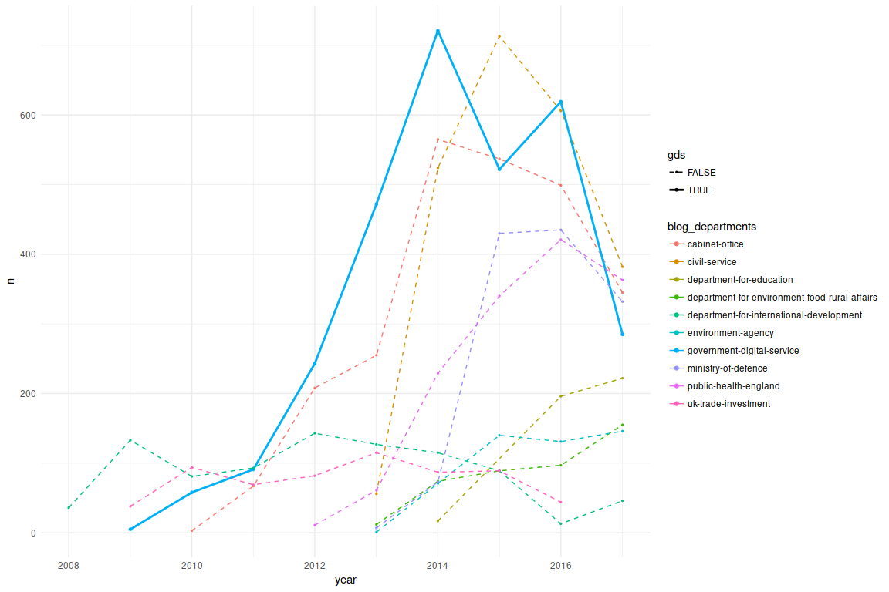
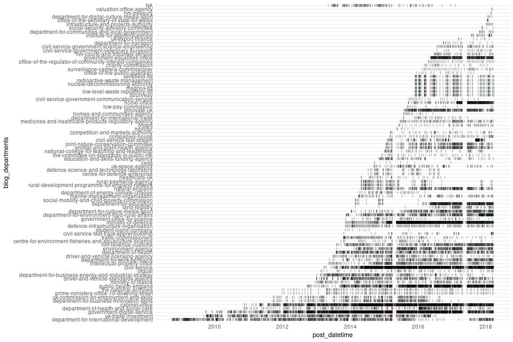
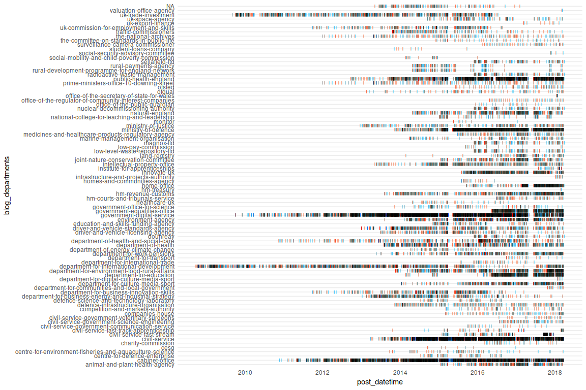
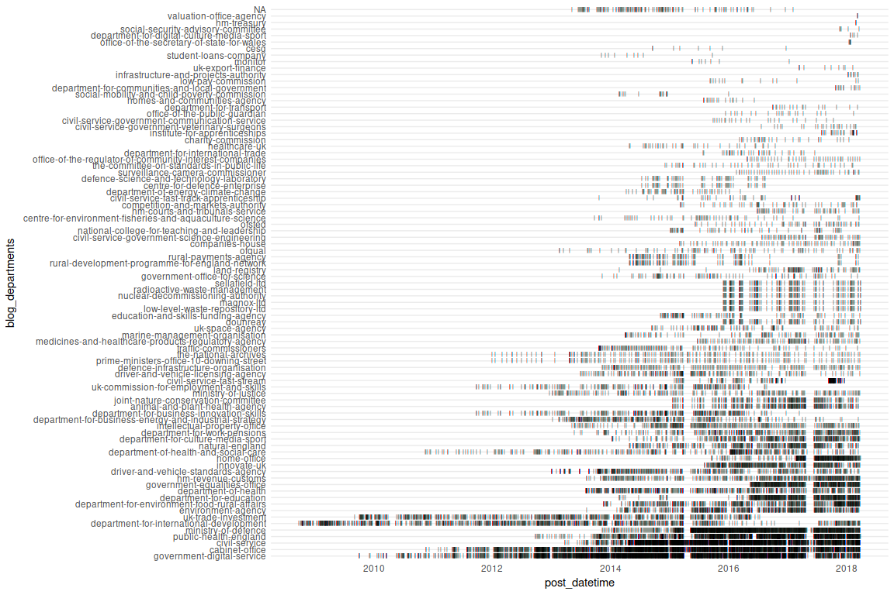

# Rough work on blog.gov.uk trends

This is not official.

1. Scrape the [list of blogs](https://www.blog.gov.uk/).
1. Supplement it with discontinued blogs in the [National Archives](http://www.nationalarchives.gov.uk/webarchive/atoz/).
1. Open every individual blog to scrape the list of posts.
1. Make some simple tables and graphs.

[All graphs and code](R/scrape-individual-blogs.md)

